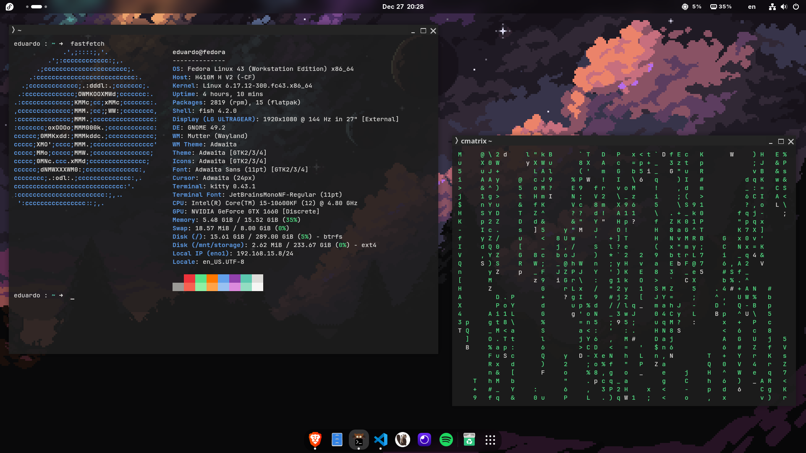
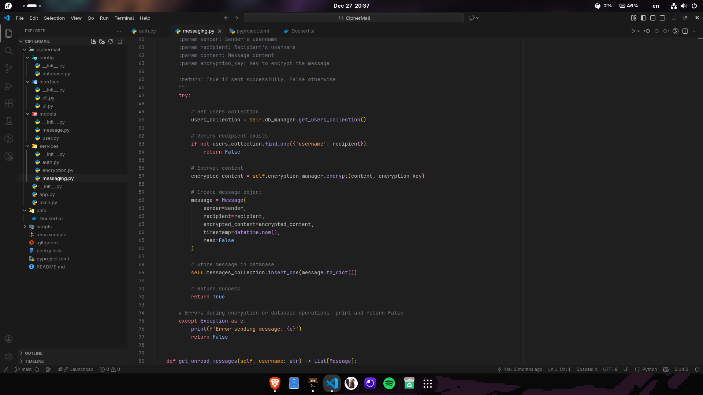

# Just my dotfile :)

My personal dotfile setup. Simple, fast, and clean.

## Stack

- [Kitty](https://github.com/kovidgoyal/kitty/) - Terminal
- [Fish](https://fishshell.com/) - Shell
- [Starship](https://starship.rs/) - Prompt
- [JetBrains Mono Nerd Font](https://www.nerdfonts.com/)

## Structure

```
.
├── fish/          # Fish shell config + nvm plugin
├── kitty/         # Kitty terminal config + theme
├── vscode/        # VSCode settings
└── starship.toml  # Starship prompt config
```

## Features

**Fish**
- Git aliases (`gs`, `ga`, `gc`, `gl`)
- Node version manager (nvm)

**Kitty**
- Adwaita Dark theme
- Custom transparency and cursor
- JetBrains Mono Nerd Font

**VSCode**
- Min Dark theme
- Material Icon Theme
- JetBrains Mono Nerd Font
- Clean UI (no minimap, breadcrumbs, sticky scroll)

**Starship**
- Minimal prompt
- Git, Python, Node, Go, C indicators

## Preview

<p align="center">
  
  
</p>
