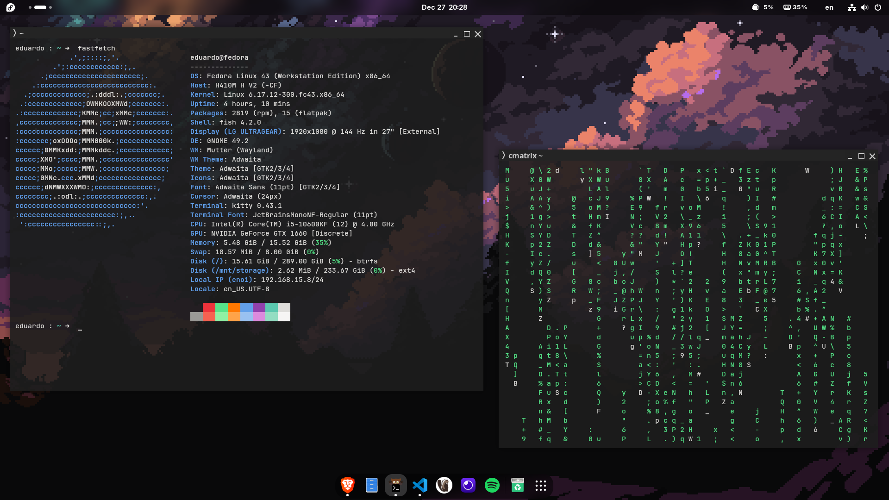
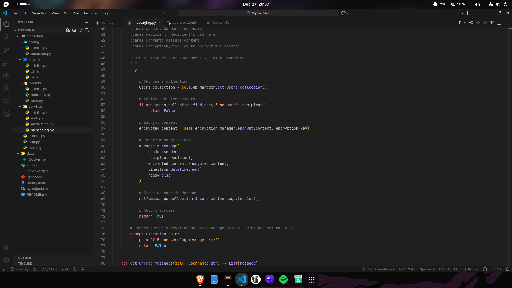

# Just my dotfile :)

My personal dotfile setup. **Simple**, **fast**, and **clean**.

## Environment

- **OS / Distro:** Fedora 43 (Workstation Edition)
- **DE (Desktop Environment):** GNOME
- **Display server:** Wayland

## Stack

- **Terminal:** [Kitty](https://github.com/kovidgoyal/kitty/)
- **Shell:** [Fish](https://fishshell.com/)
- **Plugin manager:** [Fisher](https://github.com/jorgebucaran/fisher)
- **Prompt:** [Starship](https://starship.rs/)
- **Font:** [JetBrains Mono Nerd Font](https://www.nerdfonts.com/)

## Structure

```
.
├── fish/                       # Fish shell configs + plugins
├── kitty/                      # Kitty terminal config + theme
├── peripherals/                # Peripherals configs
├── vscode/                     # VSCode settings
└── starship.toml               # Starship prompt config
```

## Features

**Fish**
- Git aliases (`gs`, `ga`, `gc`, `gl`)
- Node version manager (nvm)

**Kitty**
- Adwaita Dark theme
- Custom transparency and cursor
- JetBrains Mono Nerd Font

**VSCode**
- Min Dark theme
- Material Icon Theme
- JetBrains Mono Nerd Font
- Clean UI (no minimap, breadcrumbs, sticky scroll)

**Starship**
- Minimal prompt
- Git, Python, Node, Go, C indicators

## GNOME Extensions

- [Blur my Shell](https://github.com/aunetx/blur-my-shell)
- [Caffeine](https://github.com/eonpatapon/gnome-shell-extension-caffeine)
- [Dash to Dock](https://micheleg.github.io/dash-to-dock/)
- [Logo Menu](https://github.com/Aryan20/Logomenu)
- [System Monitor](https://gitlab.gnome.org/GNOME/gnome-shell-extensions)
- [Tiling Shell](https://github.com/domferr/tilingshell)

## Tweaks

- **Cursor:** [Bibata](https://github.com/ful1e5/Bibata_Cursor)

## Peripherals

### Logitech

- Logitech MX Master 3S
- Logitech MX Mechanical Mini

> *Managed via [Solaar](https://github.com/pwr-Solaar/Solaar) and [LogiOps](https://github.com/PixlOne/logiops)*

## Preview

<p align="center">
  
  
</p>

## Notes

These dotfiles are tailored to my personal workflow but feel free to fork, adapt, and experiment.
